**III. Sắp xếp Deliverables theo chuỗi phụ thuộc dựa trên Dependency Map**

Dựa vào bảng mô tả các đường găng và bảng deliverables, chúng ta sẽ sắp xếp các deliverables theo chuỗi phụ thuộc, bắt đầu từ các deliverables khởi đầu và đi theo các đường găng.

**Lưu ý:**

*   Các deliverables được đánh số theo bảng ở các phần trả lời trước.
*   Một deliverable có thể xuất hiện trong nhiều chuỗi.
*   Do số lượng deliverables lớn, bảng dưới đây sẽ chia thành các nhóm deliverables theo các đường găng chính.

**(Bảng này khá dài, bạn có thể cuộn theo chiều ngang để xem đầy đủ)**

| Nhóm Deliverables | Đường găng | Chuỗi Deliverables (Số thứ tự tham chiếu bảng trước) | Giải thích |
| :---------------- | :---------- | :------------------------------------------------------- | :---------- |
| **Nhóm 1: Nhận Thức & Tư Duy, Thể Chế** | Đường găng 1 | **129** (NV8) → **17** (NV37) → **124** (NV25) → **99** (NV119), **102** (NV122) → **1** (NV14), **2** (NV21), **3** (NV22), **4** (NV23), **140** (NV17), **5** (NV24), **6** (NV26), **7** (NV27), **139** (NV10), **143** (NV20) → **141** (NV18) → **142** (NV19) → **128** (NV120), **138** (NV7) | - Bắt đầu bằng việc làm rõ định nghĩa, khái niệm (NV8) để tạo cơ sở nhận thức chung.  - Tiếp theo là rà soát quy định pháp luật (NV37), xây dựng đề án cơ chế sandbox (NV25, NV48, NV124), đề án CĐS DN (NV118), đề án hình thành các DN công nghệ chiến lược quy mô lớn (NV119), đề án hỗ trợ, phát triển các doanh nghiệp công nghệ số vươn ra toàn cầu (NV122), từ đó hoàn thiện các Luật, Nghị định, chính sách khác.  - Sau đó là sửa đổi các luật quan trọng như Luật KH&CN (NV14), Luật NSNN (NV18), Luật Thuế (NV19), Luật tiêu chuẩn và Quy chuẩn kỹ thuật (NV17), Luật Tổ chức Chính phủ; Luật Tổ chức chính quyền địa phương (NV20), tạo cơ sở pháp lý cho các hoạt động tiếp theo.   - Cuối cùng là xây dựng bộ tiêu chí đánh giá mức độ chuyển đổi số doanh nghiệp (NV120), kế hoạch triển khai Chương trình hành động của Chính phủ (NV7) |
| **Nhóm 2: Hạ Tầng** | Đường găng 1, 2, 4 | **129** (NV8) → **24** (NV44) → **23** (NV43), **28** (NV48) → **25** (NV45), **26** (NV46), **27** (NV47), **29** (NV49), **30** (NV50), **34** (NV54) → **37** (NV57) → **38** (NV58), **126** (NV70) → **49** (NV69) → **51** (NV71), **52** (NV72) → **72** (NV92), **93** (NV93), **97** (NV117) → **121** (NV24, NV64) | - Bắt đầu từ việc làm rõ định nghĩa (NV8), sau đó là xây dựng danh mục công nghệ chiến lược (NV44).  - Tiếp theo là xây dựng chương trình quốc gia phát triển công nghệ chiến lược (NV43), các đề án cơ chế thử nghiệm (NV48), quỹ đầu tư (NV45), mạng lưới kết nối (NV46), đầu tư cho các tổ chức nghiên cứu (NV47), ngân sách cho nghiên cứu (NV49), cơ chế, chính sách hợp tác công tư (NV50), cơ chế hỗ trợ đầu tư (NV54).  - Tiếp đến là xây dựng danh mục, kế hoạch triển khai nền tảng số quốc gia, dùng chung (NV57).  - Sau đó triển khai các nền tảng số (NV58), hoàn thành, đưa vào khai thác 114 CSDLQG, CSDL chuyên ngành (NV70, NV126).  - Hoàn thành xây dựng trung tâm dữ liệu quốc gia (NV69).  - Hoàn thành khai thác CSDL quốc gia (NV71), kết nối chia sẻ dữ liệu (NV72).  - Xây dựng kế hoạch nâng cao chất lượng cung cấp dịch vụ công trực tuyến toàn trình (NV92), kế hoạch hỗ trợ doanh nghiệp tham gia phát triển các ứng dụng, dịch vụ số mới theo hình thức hợp tác công tư (PPP) (NV93), xây dựng Trung tâm đổi mới sáng tạo về dữ liệu (NV117).  - Cuối cùng là hoàn thành xây dựng đô thị thông minh (NV121). |
| **Nhóm 3: Nhân Lực** | Đường găng 3 | **8** (NV28, NV77) → **57** (NV77) → **58** (NV78) → **59** (NV79) → **60** (NV80), **61** (NV81), **62** (NV82), **63** (NV83), **64** (NV84), **65** (NV85), **66** (NV86), **67** (NV87), **68** (NV88), **85** (NV105), **127** (NV12) | - Bắt đầu từ việc xây dựng cơ chế thu hút nguồn lực (NV28), sau đó là xây dựng đề án phát triển nhân tài (NV77).  - Tiếp theo là xây dựng chính sách đặc thù (NV78), quy hoạch tổ chức KHCN công lập (NV79).  - Sau đó là các đề án, chính sách, quy định về phát triển nhân lực: cơ chế để nhà khoa học tham gia DN (NV80), sắp xếp hệ thống viện nghiên cứu (NV81), phát triển trường đại học (NV82), nâng cấp viện nghiên cứu (NV83), chuyển cơ sở giáo dục đại học về Bộ GD&ĐT (NV84), cơ chế thu, quản lý học phí (NV85), khung chiến lược giáo dục đại học (NV86), tiêu chuẩn chức danh giáo sư, phó giáo sư (NV87), tín dụng đối với học sinh, sinh viên (NV88).  - Xây dựng, ban hành, tổ chức thực hiện chương trình đào tạo, bồi dưỡng cho cán bộ, công chức, viên chức về kiến thức về khoa học, công nghệ, đổi mới sáng tạo (NV127)   - Cuối cùng là đề án phát triển nguồn nhân lực chất lượng cao về an toàn thông tin mạng (NV105). |
| **Nhóm 4: Hợp Tác Quốc Tế** | Đường găng 4 | **24** (NV44) → **112** (NV132) → **113** (NV133) → **114** (NV134) → **115** (NV135) → **116** (NV136), **117** (NV137), **118** (NV138), **119** (NV139), **120** (NV140), **54** (NV74) | - Bắt đầu từ việc xây dựng danh mục công nghệ chiến lược (NV44).  - Tiếp theo là tham gia tổ chức tiêu chuẩn hóa quốc tế (NV132), ngoại giao công nghệ (NV133), thiết lập khuôn khổ đối tác (NV134).  - Sau đó là nghiên cứu, chia sẻ mô hình, kinh nghiệm quốc tế (NV135).  - Tiếp đến là xây dựng cơ sở dữ liệu về chuyên gia (NV136), quy định về lập cơ sở nghiên cứu chính sách (NV137), lập cơ sở nghiên cứu (NV138), quảng bá thương hiệu quốc gia (NV139), tham gia định hình khuôn khổ quốc tế (NV140).  - Cuối cùng là ban hành các chiến lược, tiêu chuẩn, quy chuẩn kỹ thuật về dữ liệu (NV74). |
| **Nhóm 5: Ứng Dụng và Quản Trị** | Đường găng 2 | **37** (NV57) → **38** (NV58), **126** (NV70) → **49** (NV69) → **51** (NV71), **52** (NV72), **113** (NV113)  → **89** (NV89), **90** (NV90), **91** (NV91), **94** (NV94), **95** (NV95), **96** (NV96), **97** (NV97), **98** (NV98), **99** (NV99), **100** (NV100), **101** (NV101), **102** (NV102), **103** (NV103), **104** (NV104), **106** (NV106), **107** (NV107), **108** (NV108), **109** (NV109), **110** (NV110), **111** (NV111), **114** (NV114), **115** (NV115), **116** (NV116) | - Bắt đầu từ việc xây dựng danh mục nền tảng số (NV57).  - Tiếp theo là triển khai nền tảng số (NV58), hoàn thiện CSDLQG, CSDL chuyên ngành (NV70, NV126).  - Sau đó là hoàn thành xây dựng trung tâm dữ liệu quốc gia (NV69).  - Hoàn thành khai thác CSDL quốc gia (NV71), kết nối chia sẻ dữ liệu (NV72), phát triển HTTT chỉ đạo, điều hành (NV113).  - Tiếp đến là các chương trình, đề án, kế hoạch, quy định về ứng dụng và quản trị: phát triển Chính phủ số (NV89), đảm bảo liên thông (NV90), mô hình trung tâm giám sát (NV91), cắt giảm giấy phép (NV94), giải quyết TTHC (NV95), danh tính số (NV96), bảo vệ người dân trên không gian mạng (NV97), văn hóa số (NV98), CĐS lĩnh vực văn hóa (NV99), nền tảng số về tài nguyên, môi trường (NV100), CĐS hạ tầng giao thông (NV101), ứng dụng AI (NV102), sản phẩm an toàn, an ninh mạng (NV103), nâng cao năng lực an toàn, an ninh mạng (NV104), ngăn chặn tấn công mạng (NV106), CĐS phục vụ tự động hóa quân đội (NV107), nhiệm vụ CĐS (NV108), sử dụng định danh và xác thực điện tử (NV109), liên thông dữ liệu (NV110), CĐS của BV (NV111), cấp chữ ký số (NV112), kết nối, chia sẻ dữ liệu (NV114), số hóa dữ liệu ở địa phương (NV115), phát triển KHCN, công nghiệp an ninh (NV116). |

```mermaid
graph TD
    subgraph "Nhóm 1: Nhận Thức & Tư Duy, Thể Chế"
        A1[129. Làm rõ định nghĩa, khái niệm mới] --> B1[17. Đề án tháo gỡ điểm nghẽn về KHCN, ĐMST, chuyển đổi số];
        B1 --> C1[124. Cơ chế sandbox cho AI, FinTech, GovTech];
        C1 --> D1[99. Đề án hình thành các DN công nghệ chiến lược quy mô lớn];
        C1 --> E1[102. Đề án hỗ trợ, phát triển DN công nghệ số vươn ra toàn cầu];
        C1 --> F1[1. Sửa đổi Luật KH&CN];
        C1 --> G1[2. Luật Công nghiệp công nghệ số];
        C1 --> H1[3. Luật Nhà giáo];
        C1 --> I1[4. Luật sửa đổi về cơ yếu];
        C1 --> J1[140. Hoàn thiện Luật Tiêu chuẩn và Quy chuẩn kỹ thuật];
        C1 --> K1[5. Nghị quyết của Quốc hội về cơ chế đặc thù về đầu tư số];
        C1 --> L1[6. Nghị định hướng dẫn Luật KHCN, ĐMST];
        C1 --> M1[7. Nghị định về quỹ đầu tư mạo hiểm];
        C1 --> N1[139. Hồ sơ đề nghị xây dựng Luật Cán bộ, công chức];
        C1 --> O1[143. Sửa đổi Luật Tổ chức Chính phủ, Luật Tổ chức chính quyền địa phương];
        F1 --> P1[141. Sửa đổi một số quy định trong Luật Ngân sách nhà nước];
        O1 --> P1;
        P1 --> Q1[142. Rà soát để sửa đổi một số quy định trong Luật Thuế];
        Q1 --> R1[128. Bộ tiêu chí đánh giá mức độ chuyển đổi số doanh nghiệp];
        Q1 --> S1[138. Kế hoạch triển khai Chương trình hành động của Chính phủ];
    end

    subgraph "Nhóm 2: Hạ Tầng"
        A2[129. Làm rõ định nghĩa, khái niệm mới] --> B2[24. Danh mục Công nghệ chiến lược];
        B2 --> C2[23. Chương trình Quốc gia phát triển công nghệ và công nghiệp chiến lược];
        B2 --> D2[28. Cơ chế thử nghiệm chính sách cho công nghệ chiến lược];
        C2 --> E2[25. Quỹ Đầu tư phát triển công nghiệp chiến lược];
        C2 --> F2[26. Mạng lưới kết nối các trung tâm ĐMST];
        C2 --> G2[27. Đề án đầu tư cho các tổ chức nghiên cứu công lập];
        C2 --> H2[29. Ngân sách cho nghiên cứu công nghệ chiến lược];
        C2 --> I2[30. Cơ chế, chính sách hợp tác công tư PPP về công nghệ, hạ tầng số, nhân lực số];
        C2 --> J2[34. Cơ chế hỗ trợ đầu tư phòng thí nghiệm, trung tâm R&D];
        J2 --> K2[37. Danh mục, kế hoạch triển khai nền tảng số quốc gia, dùng chung];
        K2 --> L2[38. Triển khai các nền tảng số quốc gia, dùng chung];
        K2 --> M2[126. Hoàn thành XD, kết nối, chia sẻ CSDL quốc gia, CSDL các ngành];
        L2 --> N2[49. Trung tâm dữ liệu quốc gia];
        M2 --> N2;
        N2 --> O2[51. Hoàn thành, đưa vào khai thác CSDL quốc gia, CSDL dùng chung];
        N2 --> P2[52. Hoàn thành kết nối, chia sẻ dữ liệu, triển khai mở dữ liệu];
        O2 --> Q2[72. Kế hoạch nâng cao chất lượng cung cấp dịch vụ công trực tuyến toàn trình];
        P2 --> Q2;
        O2 --> R2[93. Kế hoạch hỗ trợ doanh nghiệp tham gia phát triển ứng dụng, dịch vụ số mới];
        P2 --> R2;
        O2 --> S2[97. Trung tâm đổi mới sáng tạo về dữ liệu thuộc Trung tâm dữ liệu quốc gia];
        P2 --> S2;
        B2 --> T2[121. Hoàn thành xây dựng đô thị thông minh];
    end
    
    subgraph "Nhóm 3: Nhân Lực"
        A3[8. Chính sách về nhân lực cho ĐMST, bán dẫn, AI] --> B3[57. Đề án phát triển, trọng dụng nhân tài, nhân lực chất lượng cao];
        B3 --> C3[58. Chính sách thu hút, tuyển dụng, đãi ngộ nhân lực chuyển đổi số];
        C3 --> D3[59. Quy hoạch các tổ chức KHCN công lập];
        D3 --> E3[60. Cơ chế để nhà khoa học thành lập, điều hành doanh nghiệp];
        D3 --> F3[61. Đề án sắp xếp hệ thống viện nghiên cứu trong cơ sở giáo dục đại học];
        D3 --> G3[62. Đề án phát triển trường đại học thành chủ thể nghiên cứu mạnh];
        D3 --> H3[63. Đề án đầu tư, nâng cấp Viện Hàn lâm KHCN, KHXH, cơ sở nghiên cứu trọng điểm];
        D3 --> I3[64. Đề án chuyển cơ sở giáo dục đại học về Bộ GD&ĐT quản lý];
        D3 --> J3[65. Nghị định về cơ chế thu, quản lý học phí];
        D3 --> K3[66. Khung chiến lược giáo dục đại học];
        D3 --> L3[67. Sửa đổi quy định về tiêu chuẩn, bổ nhiệm chức danh giáo sư, phó giáo sư];
        D3 --> M3[68. Sửa đổi quy định về tín dụng đối với học sinh, sinh viên];
        G3 --> N3[85. Đề án phát triển nguồn nhân lực chất lượng cao về an toàn thông tin mạng];
        G3 --> O3[127. Chương trình đào tạo, bồi dưỡng cho cán bộ, công chức, viên chức về KHCN, ĐMST];
    end

    subgraph "Nhóm 4: Hợp Tác Quốc Tế"
        A4[24. Danh mục Công nghệ chiến lược] --> B4[112. Đề án Việt Nam tham gia các tổ chức tiêu chuẩn hóa quốc tế];
        B4 --> C4[113. Chương trình/Kế hoạch triển khai ngoại giao công nghệ];
        C4 --> D4[114. Khuôn khổ đối tác về KHCN, ĐMST, CĐS với các tập đoàn công nghệ hàng đầu];
        D4 --> E4[115. Nghiên cứu, chia sẻ mô hình, kinh nghiệm quốc tế về KHCN, ĐMST, CĐS];
        E4 --> F4[116. Cơ sở dữ liệu về chuyên gia, trí thức VN ở nước ngoài];
        E4 --> G4[117. Quy định về lập cơ sở nghiên cứu chính sách về công nghệ số tại DN];
        E4 --> H4[118. Lập cơ sở nghiên cứu chính sách về công nghệ số và chuyển giao công nghệ từ nước ngoài];
        E4 --> I4[119. Chương trình quảng bá thương hiệu quốc gia về ĐMST];
        E4 --> J4[120. Tham gia định hình khuôn khổ, quy tắc, quản trị về KHCN, ĐMST, CĐS];
        A4 --> K4[54. Cơ chế hỗ trợ đầu tư phòng thí nghiệm, trung tâm R&D];
    end

    subgraph "Nhóm 5: Ứng Dụng và Quản Trị"
        A5[37. Danh mục, kế hoạch triển khai nền tảng số quốc gia, dùng chung] --> B5[38. Triển khai các nền tảng số quốc gia, dùng chung];
        A5 --> C5[126. Hoàn thành XD, kết nối, chia sẻ CSDL quốc gia, CSDL các ngành];
        B5 --> D5[49. Trung tâm dữ liệu quốc gia];
        C5 --> D5;
        D5 --> E5[51. Hoàn thành, đưa vào khai thác CSDL quốc gia, CSDL dùng chung];
        D5 --> F5[52. Hoàn thành kết nối, chia sẻ dữ liệu, triển khai mở dữ liệu];
        F5 --> G5[113. Bộ chỉ số, Hệ thống thông tin phục vụ chỉ đạo, điều hành của CP, TTg];
        G5 --> H5[89. Chương trình phát triển Chính phủ số];
        G5 --> I5[90. Quy định đảm bảo liên thông, đồng bộ, bí mật nhà nước trong CĐS];
        G5 --> J5[91. Mô hình Trung tâm giám sát, điều hành thông minh];
        G5 --> K5[72. Kế hoạch nâng cao chất lượng cung cấp dịch vụ công trực tuyến toàn trình];
        G5 --> L5[94. Chương trình cắt giảm giấy phép, chuyển giao cho DN, tổ chức xã hội];
        G5 --> M5[95. Nghị quyết về giải quyết TTHC, cung cấp DV công không phụ thuộc địa giới];
        G5 --> N5[96. Kế hoạch để mỗi người dân có danh tính số, phương tiện số, kỹ năng số, tài khoản số];
        G5 --> O5[97. Kế hoạch hỗ trợ, bảo vệ người dân trên không gian mạng];
        G5 --> P5[98. Quy chế văn hóa số cộng đồng, quy tắc ứng xử trên không gian mạng];
        G5 --> Q5[99. Đề án chuyển đổi số trong lĩnh vực Văn hóa];
        G5 --> R5[100. Nền tảng số giám sát, thu thập dữ liệu tài nguyên, môi trường];
        G5 --> S5[101. Đề án chuyển đổi số trong hoạt động XD, quản lý, khai thác hạ tầng giao thông];
        G5 --> T5[102. Ứng dụng AI hỗ trợ phân tích, cảnh báo thiên tai, biến đổi khí hậu, bảo vệ MT];
        G5 --> U5[103. Nền tảng, sản phẩm quốc gia đảm bảo an toàn, an ninh mạng];
        G5 --> V5[104. Đề án nâng cao năng lực hoạt động của lực lượng quốc gia về an toàn, an ninh mạng];
        G5 --> W5[106. Đề án phát hiện, đấu tranh ngăn chặn tấn công mạng, gián điệp mạng...];
        G5 --> X5[107. Đề án phát triển KHCN, ĐMST, CĐS phục vụ tự động hóa chỉ huy, hiện đại hóa quân đội];
        G5 --> Y5[108. Triển khai nhiệm vụ CĐS, kết nối với Đề án 06];
        G5 --> Z5[109. Hướng dẫn DN cung cấp TMĐT sử dụng định danh và xác thực điện tử];
        G5 --> A6[110. Giải pháp, công cụ giám sát cơ sở khám chữa bệnh thực hiện liên thông dữ liệu];
        G5 --> B6[111. Triển khai Đề án chuyển đổi số của BV Bạch Mai, Chợ Rẫy, Bắc Ninh, Bình Dương, An Giang];
        G5 --> C6[112. Ưu đãi cấp chữ ký số cho cơ sở y tế, cán bộ, nhân viên y tế, người bệnh];
        G5 --> D6[114. Kết nối, chia sẻ dữ liệu phục vụ phát triển TMĐT, quản lý thuế, đăng ký DN, hóa đơn ĐT];
        G5 --> E6[115. Số hóa dữ liệu, khai thác ứng dụng cắt giảm TTHC ở địa phương];
        G5 --> F6[116. Đề án đột phá phát triển KHCN, công nghiệp an ninh];
    end
```

**Giải thích:**

*   Mỗi subgraph đại diện cho một nhóm deliverables.
*   Mỗi node đại diện cho một deliverable, với số thứ tự tương ứng trong bảng deliverables đã trình bày ở các phần trả lời trước.
*   Mũi tên thể hiện mối quan hệ phụ thuộc: A --> B có nghĩa là A phải hoàn thành trước B.
*   Do số lượng deliverables lớn và mối quan hệ phức tạp, biểu đồ này chỉ thể hiện các mối quan hệ phụ thuộc chính dựa trên các đường găng đã xác định.
*   Trong thực tế, có thể có các mối quan hệ phụ thuộc chéo giữa các nhóm deliverables khác nhau mà biểu đồ này chưa thể hiện hết.

