# Mô hình tổ chức

1. ## Mô hình tổ chức chung

### Giải thích:

* **Tổng Bí thư** là Trưởng Ban Chỉ đạo TW.

* **Ban Chỉ đạo TW** quyết định định hướng, điều phối chung.

* **Tổ Giúp việc** (Văn phòng TW Đảng) và **Hội đồng Tư vấn** (chuyên gia) hỗ trợ Ban Chỉ đạo.

* **Cục Chuyển đổi số** trực thuộc Văn phòng TW Đảng, là hạt nhân thực thi CĐS trong khối Đảng.

* **Chính phủ, Quốc hội, Ban Kinh tế TW, Ban Tuyên giáo TW, Mặt trận TQ**… đều phối hợp thực hiện theo phạm vi nhiệm vụ.

### Code

Diagram

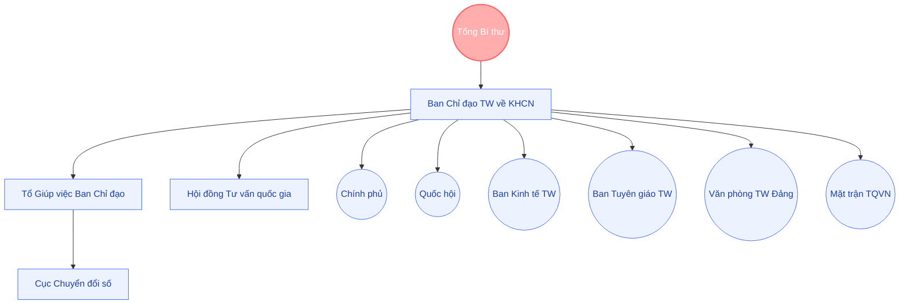

## 2\. Mô hình Ban Chỉ đạo TW; Hội đồng tư vấn; Tổ Giúp việc Ban Chỉ đạo TW; Cục Chuyển đổi số các cơ quan Đảng

**Giải thích ngắn gọn**:

* **Ban Chỉ đạo TW** ở cấp cao nhất.

* **Hội đồng tư vấn quốc gia** cung cấp thẩm định chuyên môn.

* **Tổ Giúp việc Ban Chỉ đạo** (Văn phòng TW Đảng) chịu trách nhiệm tham mưu, tổng hợp.

* **Cục Chuyển đổi số** (trong cơ quan Đảng) phối hợp với Hội đồng tư vấn và Tổ Giúp việc, đóng vai trò triển khai CĐS, tư vấn sáng kiến (qua các bước thủ tục).

Code:

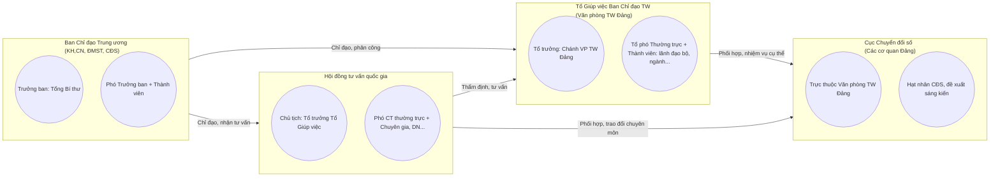

## 3\. Mô hình Ban Chỉ đạo chuyển đổi số các cơ quan Đảng; Tổ Giúp việc; và Cục Chuyển đổi số các cơ quan Đảng

**Giải thích ngắn gọn**:

* **Ban Chỉ đạo chuyển đổi số các cơ quan Đảng** do **Thường trực Ban Bí thư** làm Trưởng ban.

* **Tổ Giúp việc** (của Ban Chỉ đạo CĐS các cơ quan Đảng) do **Phó Chánh Văn phòng TW Đảng** làm Tổ trưởng.

* **Cục Chuyển đổi số** trong cơ quan Đảng chịu trách nhiệm **triển khai** đề án CĐS, **báo cáo** cho Tổ Giúp việc và Ban Chỉ đạo CĐS các cơ quan Đảng.

**Code:**

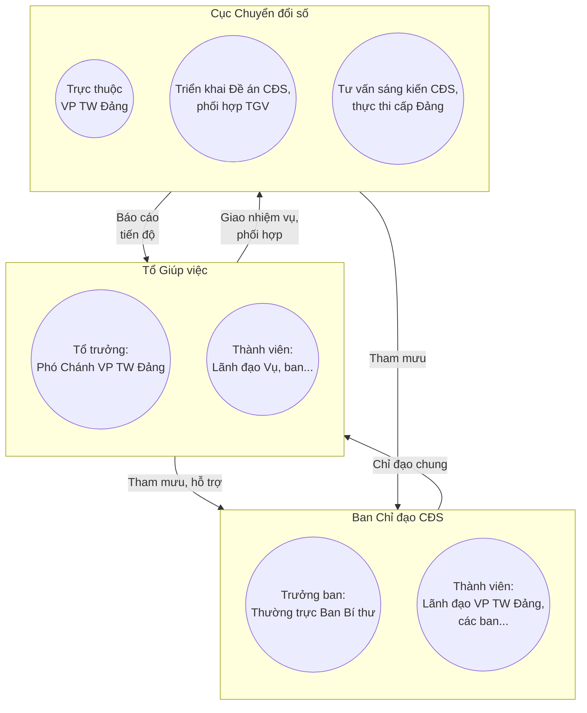

## 4\. Nhóm nhiệm vụ

### **1\. Nhóm 1**: Hoàn thiện Thể chế, Pháp luật, Chính sách

#### *Giải thích tóm tắt:*

* **R (Responsible)**: Chính phủ (Ban Cán sự Đảng CP), Bộ Tư pháp (đầu mối soạn thảo).

* **C (Consulted)**: Ban Kinh tế TW, Tổ Giúp việc, Cục CĐS (nếu có nội dung về khối Đảng), chuyên gia, DN...

* **A (Accountable)**: Quốc hội (Đảng đoàn QH) phê duyệt ở cấp lập pháp.

* **I (Informed)**: Ban Chỉ đạo TW, Văn phòng TW Đảng, MTTQ, Ban Tuyên giáo… được cập nhật kết quả.

#### *Code:*

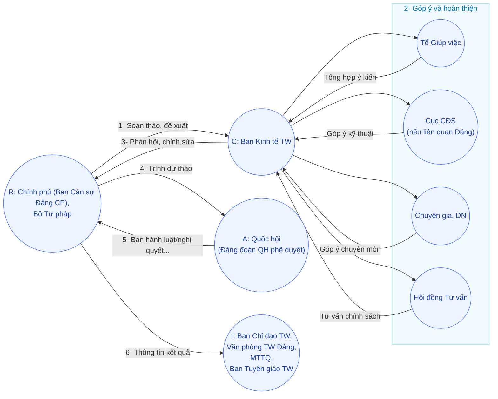

2. ### **Nhóm 2**: Phát triển Hạ tầng số, Công nghệ chiến lược, Dữ liệu

#### *Tóm lược:*

* **R**: Chính phủ (Bộ KH,CN & CĐS, Bộ Tài chính & ĐTPT, DN công nghệ) — trực tiếp triển khai hạ tầng số, trung tâm dữ liệu, v.v.

* **C**: Ban Chỉ đạo TW, Tổ Giúp việc, Cục CĐS (nếu phần hạ tầng số cho khối Đảng).

* **A**: Thủ tướng (chịu trách nhiệm cao nhất về phê duyệt, chỉ đạo chi tiết).

* **I**: Quốc hội, Văn phòng TW Đảng, MTTQ…

#### *Code:*

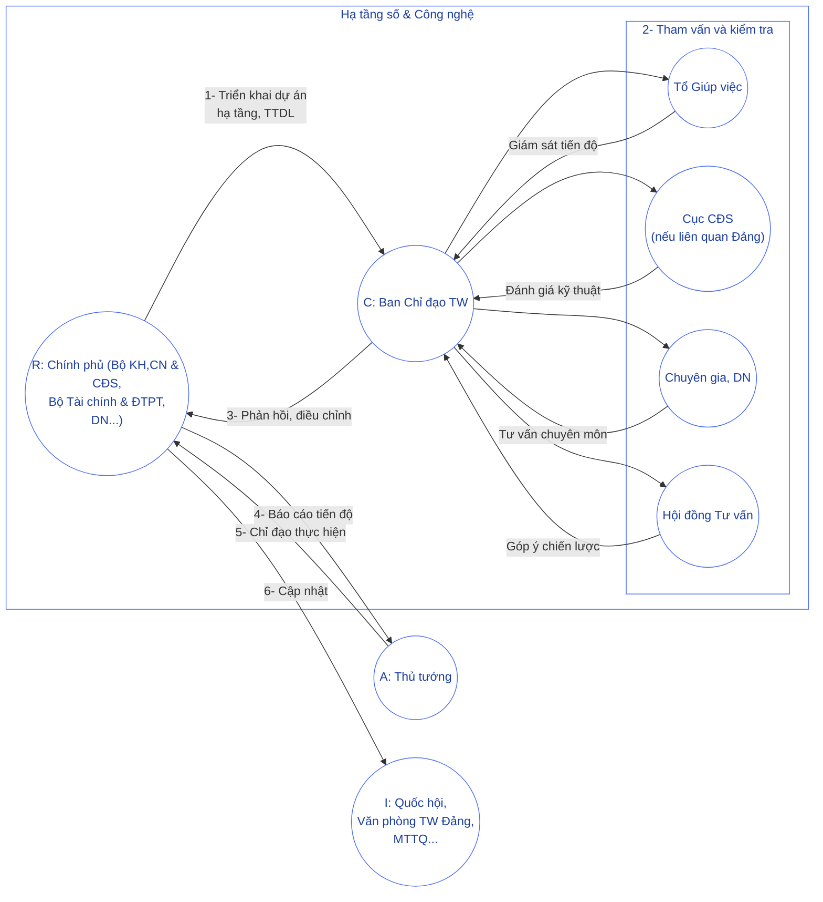

3. ### Nhóm 3: Phát triển & Thu hút Nguồn nhân lực chất lượng cao

#### *Tóm lược:*

* **R**: Chính phủ (Bộ GD&ĐT, Bộ Nội vụ & Lao động, Bộ KH,CN & CĐS).

* **C**: Ban Kinh tế TW, Hội đồng tư vấn, Cục CĐS (nếu áp dụng với khối Đảng), DN, viện, trường…

* **A**: Thủ tướng.

* **I**: Ban Chỉ đạo TW, Mặt trận TQ, Ban Tuyên giáo…

#### *Code:*

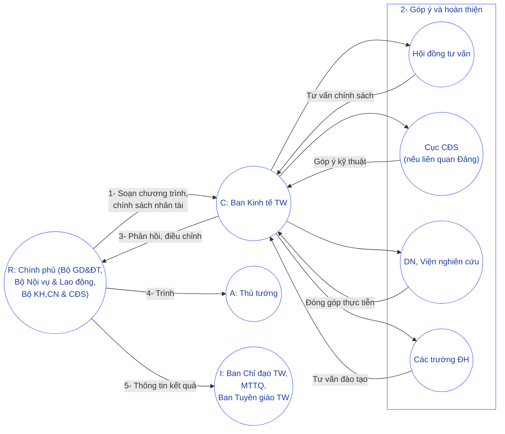

4. ### **Nhóm 4**: Thúc đẩy Ứng dụng, Đổi mới sáng tạo trong DN & Xã hội

#### *Code:*
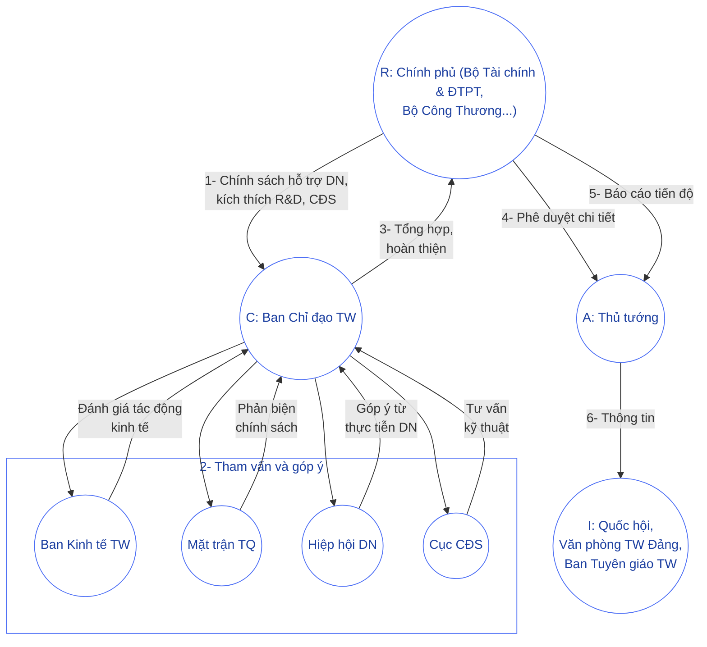

5. ### **Nhóm 5**: Bảo đảm An ninh mạng, An toàn dữ liệu, Chủ quyền số

Code:

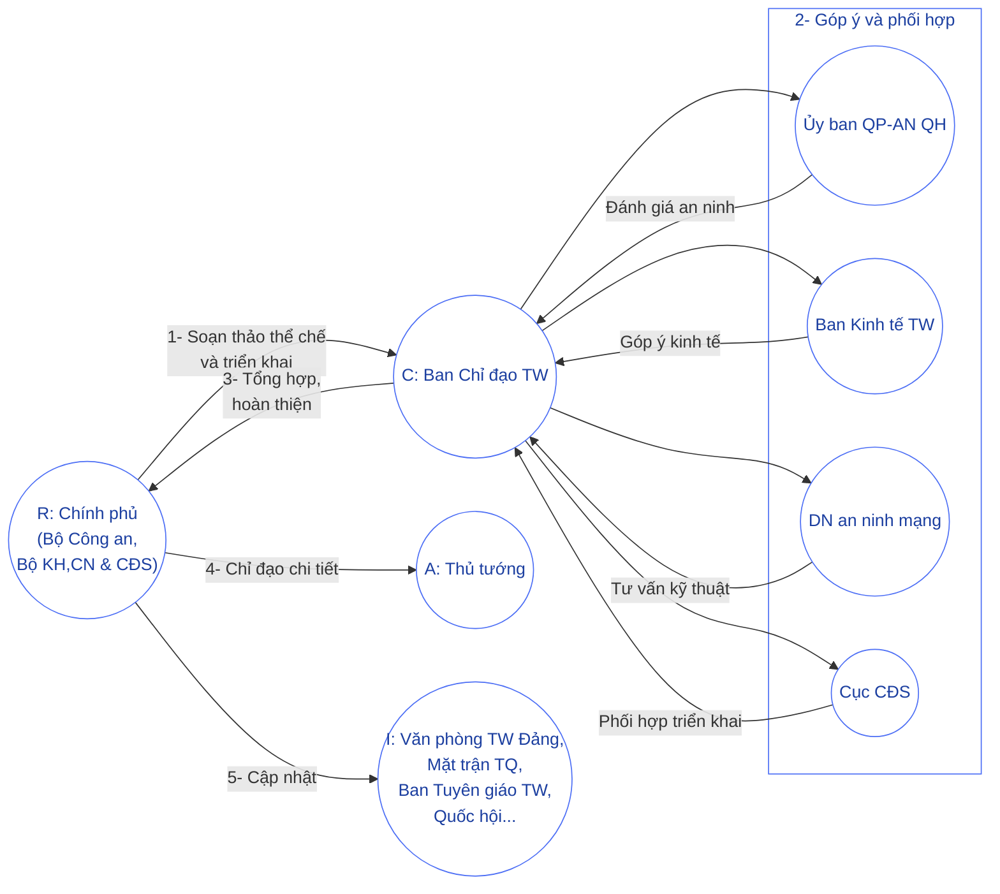

6. ### **Nhóm 6**: Công tác Tuyên truyền, Vận động Nhân dân, Giám sát & Phản biện Xã hội

Code:

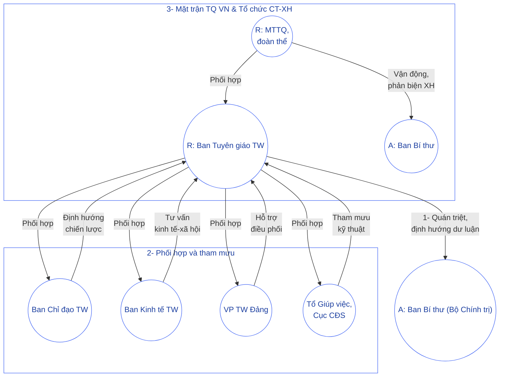

7. ### **Nhóm 7**: Theo dõi, Kiểm tra, Đánh giá & Tổng hợp Báo cáo

Code:

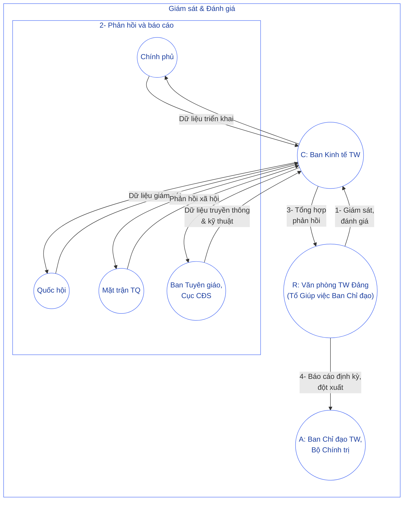

8. ### **Nhóm 8**: Khởi xướng & Triển khai Sáng kiến Chiến lược do Tổng Bí thư khởi xướng

#### *Giải thích:*

1. **Cục CĐS** chuẩn bị, tư vấn sáng kiến chiến lược.

2. Gửi (R) \-\> **Hội đồng tư vấn** & **Tổ Giúp việc**, (C) \-\> **Văn phòng TW Đảng**.

3. **Ban Chỉ đạo TW** (A) xem xét, quyết nghị.

4. Sau đó **Ban Chỉ đạo** có thể báo cáo lên **Tổng Bí thư / Bộ Chính trị** (I) để có ý kiến cuối cùng.

#### *Code:*

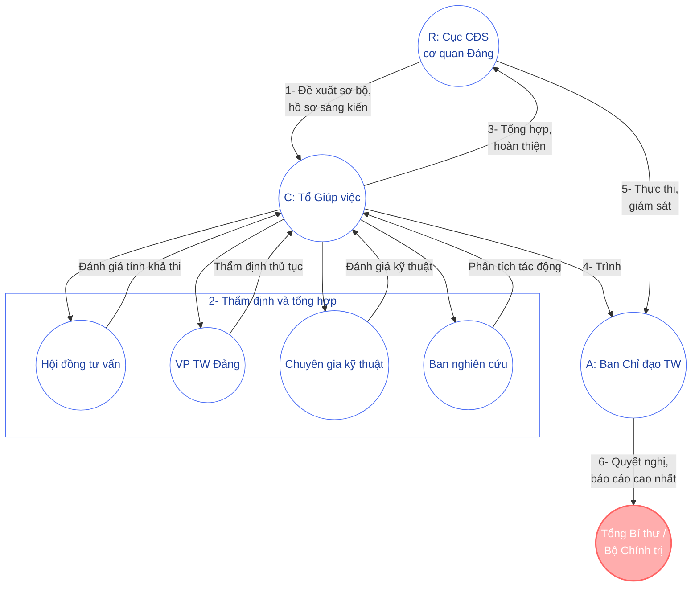
